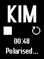

# kimai2-cmd-rainmeter
Rainmeter widget for Kimai2

[Rainmeter](https://www.rainmeter.net/) is an open source desktop customization tool for Windows

[Kimai2](https://www.kimai.org/) is an open source self-hosted time tracker

This widget uses [kimai2-cmd](https://github.com/infeeeee/kimai2-cmd). Executable included in this repo and in the rmskin package.

## Variants

- kimai-default: similar to the Kimai webui

- infinibar: fits my hardware monitor skin [infinibar](https://github.com/infeeeee/infinibar)

If you have an idea of another variant, just open an issue!

## Installation

### Prerequisites

- Install Rainmeter
- Install Kimai on your server
- Create an API password for your username on your Kimai installation. In Kimai: User menu (Top right corner) -> Edit -> API

### Installation

- Download the rmskin package from [releases](https://github.com/infeeeee/kimai2-cmd-rainmeter/releases/latest)
- Open the rmskin package with Rainmeter, enable the skin
- Click on the Kimai logo, and add your server address and creditentials in the opening new window
- Click on the reload icon to update the skin

## Usage

- Click on the Kimai logo to open yourt Kimai webui in your default browser
- Click on the name of the current active recording or on the 'No active recording' text to show your recent measurements
- Click on one of a recent measurement to restart it
- Click on the ▶️ play button to restart your latest measurement
- Click on the ⏹ stop button to stop your current measurement
- Click on the 🔄 reload button to reload settings from the server. Play and stop also reloads everything, use this button if you made changes on the Kimai webUI
- When you click on the 🔄 reload button it will disappear and only reapper if everything was reloaded successfully. 

## Settings

### Kimai specific settings

Settings stored in the `@Resources\kimai2-cmd\settings.ini` file. You can change your server settings here, reload the skin after you modified this file.

### Variant specific settings

- kimai2-default: `kimai2\kimai-default.ini`
- infinibar: 
  - `@Resources\infinibar`: this files are same as the settings files of the infinibar skin, contains a lot of unnecessary variables
  - `kimai2\infinibar.ini`

## Troubleshooting

If the widget is out of sync, try to click on the 🔄 reload button!

The widget only supports single concurrent measurements! If you click on the ⏹ stop button it will stop all ongoing measurement, and it only shows the latter started current measurement.

## Acknowledgments

The font used in the infinibar skin is Accidental Residency, created by Tepid Monkey.

## License

MIT